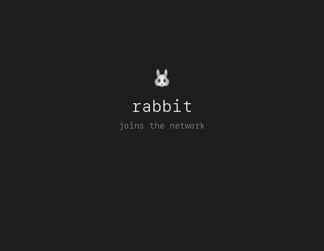

# claude-whisper

[](https://github.com/druide67/claude-whisper/actions/workflows/tests.yml)
[](LICENSE)
[](#)
[](#requirements)
[](#requirements)
[](#)
[](#)

> Inter-instance communication that costs zero tokens and zero daemons. Works everywhere — CLI, VS Code, JetBrains, Desktop.

Your [Claude Code](https://claude.ai/code) instances can now talk to each other. ~300 lines of bash — no server, no setup.

<p align="center">
  
</p>

## The problem

Existing solutions for multi-instance communication only work in the CLI — switch to VS Code or JetBrains and you're out of luck. They also require daemons, databases, runtime dependencies, and burn tokens on polling.

## The solution

**claude-whisper** uses the filesystem as a message bus and Claude Code's native hooks as the event loop. Messages are JSON files. Delivery is atomic. Reception costs zero tokens when the inbox is empty.

**Works everywhere Claude Code runs** — CLI, VS Code, JetBrains, Desktop. No plugin compatibility issues, no CLI-only limitations. Hooks are defined at user level, active across all surfaces.

## Getting started

### 1. Clone (once per machine)

```bash
git clone https://github.com/druide67/claude-whisper.git ~/claude-whisper
```

### 2. Tell Claude to install

Open your project in Claude Code (CLI, VS Code, or JetBrains) and say:

> Install whisper for this project with peer-id "my-app". Run `bash ~/claude-whisper/bin/whisper-init my-app`.

Claude executes the command, sees the available commands in the output, and saves them to its memory. **That's it — one step per project.**

Repeat for each project with a unique peer-id (e.g. `backend`, `mobile`, `api`). After the first init, `whisper-init` is in the PATH — Claude can just run `whisper-init <peer-id>`.

<details>
<summary>Manual setup (without Claude)</summary>

```bash
cd ~/projects/my-app && bash ~/claude-whisper/bin/whisper-init my-app
```

Then copy-paste the onboarding prompt (printed at the end) into your Claude Code session so it learns the commands.
</details>

## Commands

| Command | Description |
|---------|-------------|
| `whisper-init <peer-id>` | Register a project and install the hook |
| `whisper-send <peer-id> "message"` | Send a message to a peer |
| `whisper-send -t <thread> <peer-id> "message"` | Send with a thread tag (e.g. `auth-refactor`) |
| `whisper-broadcast "message"` | Send to all registered peers |
| `whisper-list` | List peers with inbox status |
| `whisper-clean [days]` | Remove archived messages older than N days (default: 7) |

Messages are received automatically — the hook injects them into Claude's context at the next prompt. Empty inbox = silent, zero tokens.

## Message format

Messages support full markdown. Send rich, structured updates:

```bash
whisper-send backend "## Auth refactor done

- New \`AuthProvider\` with OAuth2 support
- **Breaking**: \`getUser()\` now returns \`Promise<User | null>\`
- Run \`npm update @app/auth\` before merging"
```

The recipient sees:

```
━━━ 📨 whisper — 1 message(s) ━━━
> **frontend** (14:32): ## Auth refactor done
>
> - New `AuthProvider` with OAuth2 support
> - **Breaking**: `getUser()` now returns `Promise<User | null>`
> - Run `npm update @app/auth` before merging
━━━
```

Thread tags appear in brackets:

```
━━━ 📨 whisper — 1 message(s) ━━━
> **frontend** (14:32) [auth-refactor]: Check your imports
━━━
```

## How it works

1. **Send** — `whisper-send` writes a JSON file to `~/.claude-whisper/inbox/<peer>/`
2. **Receive** — a `UserPromptSubmit` hook checks the inbox at every prompt
3. **Empty inbox** — hook exits silently in <5ms — zero tokens, zero overhead

```
💻 Instance A                        💻 Instance B
     │                                    │
     │  whisper-send B "hello"            │
     └──── 📄 ──→ ~/.claude-whisper/ ─────┘
                    inbox/B/msg.json
                         │
              user types a prompt
                         │
                    📨 hook reads inbox
                    ✉️  message shown to Claude
```

## Comparison

| | claude-whisper | claude-peers-mcp | claude-ipc-mcp |
|---|---|---|---|
| **Lines of code** | ~300 | ~2,000 | ~2,200 |
| **Daemon** | None | HTTP broker | TCP broker |
| **Database** | Filesystem | SQLite | SQLite |
| **Runtime** | bash + jq | Bun | Python 3.12 |
| **Tokens at rest** | 0 | ~500-800/poll | ~50-200/poll |
| **Network surface** | None | localhost:7899 | localhost:9876 |
| **Setup time** | < 1 min | 5-10 min | 10-15 min |
| **IDE support** | CLI, VS Code, JetBrains, Desktop | CLI only | CLI only |

*Competitor figures are approximate, based on public repositories.*

## Requirements

- **macOS** or **Linux** (WSL on Windows)
- **bash** (included on macOS and Linux)
- **jq** (`brew install jq` / `apt install jq`)
- **Claude Code** v2+ (CLI, VS Code, JetBrains, Desktop)

## Security

- **No network surface** — everything stays on the local filesystem
- **Unix permissions** — `~/.claude-whisper/` is `0700`, messages are `0600`
- **Atomic writes** — messages written to `.tmp` then moved (no partial reads)
- **Input validation** — peer-ids restricted to `[a-zA-Z0-9-]`, path traversal blocked
- **No secrets** — messages are plain text files, don't send credentials

## Limitations

- **Cowork**: can send messages but cannot receive automatically (sandbox limitation).
- **Single machine**: whisper uses the local filesystem — no cross-machine messaging.
- **Not real-time**: messages are delivered at the recipient's next prompt, not instantly.

## Contributing

Issues and PRs welcome. Run `bats tests/` before submitting. See [CONTRIBUTING.md](CONTRIBUTING.md) for details.

If claude-whisper is useful to you, a star helps others discover it.

## License

Apache 2.0
